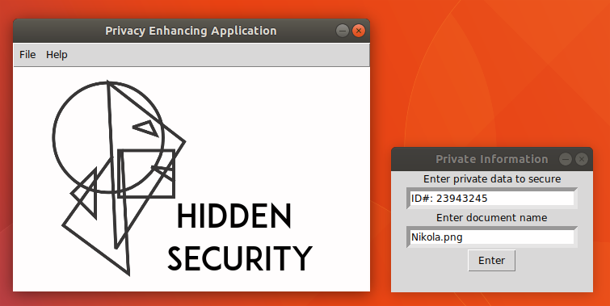
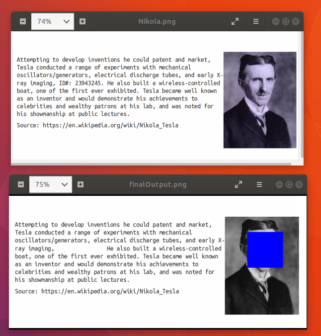

# imgPlayer

The function of this program is to scan digital data and hide sensitive information.  Private data such as faces or specific strings will be modified to stop pryin eyes from seeing the real information.  

Users are able to input the private information that needs to be secured. This string can be a phone number, an email address, a name, an entire senstence, etc.  

## Requirements 
 + [Ubuntu](https://www.ubuntu.com/)
 + [OpenCV](https://pypi.python.org/pypi/opencv-python) 
 + [Python3](https://www.python.org/downloads/)

## Demo

  
  

### Thank you
+ [Logo Dusk](http://logodust.com/) for their awesome open source logos
+ [Harrison Kinsley](http://pythonprogramming.net/) for his amazing toturials about OpenCV and Python
+ [abidrahmank](https://opencv-python-tutroals.readthedocs.io/en/latest/) for the openCV documentation 
